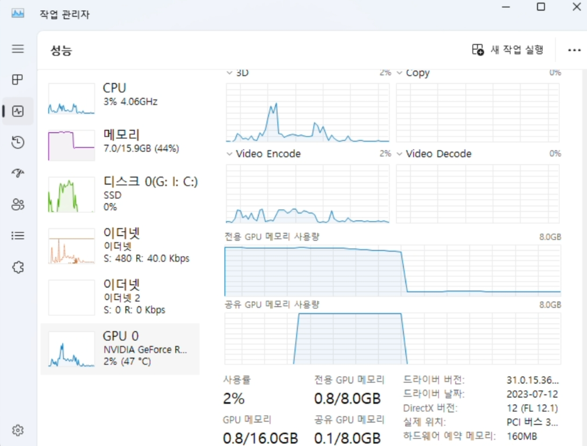

# CUDA setup for Pytorch (Windows 10) &darr; [url](https://pytorch.org/get-started/locally/)

CPU 버전 pytorch를 설치했다면, 기존 버전을 제거하자. &darr;
```bash
pip uninstall torch torchvision
```
이후 GPU 버전 pytorch 설치. 위 url에서 torch버전과 그에 맞는 [cuda 버전을 확인](https://pytorch.org/get-started/locally/)하자.

<font color="#F78181">torch</font> == 2.0.1<br><font color="#58FAAC">cuda</font> 11.7 or 11.8 &darr;

```bash
pip3 install torch torchvision torchaudio --index-url https://download.pytorch.org/whl/cu118
```
```python
import torch

print(torch.__version__)
print(torch.cuda.is_available())
```
> 2.0.1+cu118<br>
True

```python
import torch

print('-----Torch 버전 및 GPU 사용 가능 여부-----')
print('Torch Version : ', torch.__version__)
print('CUDA 사용 가능 여부 : ', torch.cuda.is_available())
print('GPU 이름 : ', torch.cuda.get_device_name(0))
print('GPU 개수 : ', torch.cuda.device_count())
print('GPU 현재 사용 중인 곳 : ', torch.cuda.current_device())
print('GPU 현재 사용 중인 곳 이름 : ', torch.cuda.get_device_name(torch.cuda.current_device()))
print('\n-----GPU 메모리 할당 상태-----')
print("GPU 총 메모리 : ", round(torch.cuda.get_device_properties(0).total_memory / 1024**2, 1), 'MB')
print("할당된 GPU 메모리 : ", round(torch.cuda.memory_allocated() / 1024**2, 1), 'MB')
print("캐시된 GPU 메모리 : ", round(torch.cuda.memory_cached() / 1024**2, 1), 'MB')
```
> -----Torch 버전 및 GPU 사용 가능 여부-----<br>
Torch Version :  2.0.1+cu118<br>
CUDA 사용 가능 여부 :  True<br>
GPU 이름 :  NVIDIA GeForce RTX 3070<br>
GPU 개수 :  1<br>
GPU 현재 사용 중인 곳 :  0<br>
GPU 현재 사용 중인 곳 이름 :  NVIDIA GeForce RTX 3070<br><br>
-----GPU 메모리 할당 상태-----<br>
GPU 총 메모리 :  8191.5 MB<br>
할당된 GPU 메모리 :  0.0 MB<br>
캐시된 GPU 메모리 :  0.0 MB<br>

CUDA 메모리 초기화
```bash
pip install numba
```
```python
from numba import cuda

device = cuda.get_current_device(); device.reset()
```
이후 초기화 완료 &darr;

